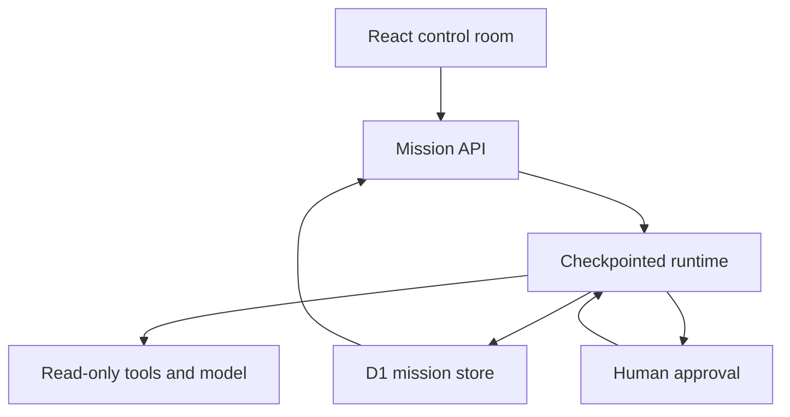

# Agent Observatory

**Un document ou un dépôt GitHub, quatre personnages animés, un diagnostic avec ses sources.**

## À quoi ça sert ?

Agent Observatory aide à repérer les points à vérifier dans les documents d’un projet technique : reprise après une panne, droits d’accès, validation humaine, tests et limites déclarées. Il produit des constats sourcés et un rapport à télécharger. Il ne modifie pas le projet et n’exécute pas son code.

La vue principale est en français et suit trois actions :

1. Choisir un exemple, un dépôt GitHub public ou coller un texte.
2. Lancer l’analyse et voir les personnages organiser, lire, analyser et vérifier.
3. Relire les constats, ouvrir leurs sources et autoriser le rapport.

Les personnages proviennent de [hemvall/avatar-lab](https://github.com/hemvall/avatar-lab). Ils flottent, changent d’expression, montrent leurs outils pendant une étape, dorment pendant une pause et célèbrent le résultat. Les 14 apparences restent disponibles. Les animations respectent la préférence de réduction du mouvement.

Le mode démo est utilisable sans clé. Il utilise des règles documentaires, pas un modèle IA. Les exemples intégrés sont fictifs. Le mode IA appelle un modèle configuré côté serveur.

L’historique, les exports et la reprise sont conservés. La **Vue technique**, accessible dans le pied de page, donne accès au journal des outils, à la relecture et à la comparaison des missions. La vue simple espace les étapes de 3,6 secondes pour laisser comprendre le travail ; ce délai n’est pas présenté comme du temps de calcul.

## Two honest execution modes

| Mode               | What happens                                                                                                                                                                                   | Credentials                                    |
| ------------------ | ---------------------------------------------------------------------------------------------------------------------------------------------------------------------------------------------- | ---------------------------------------------- |
| Deterministic demo | Real orchestration, source collection, rule-based findings, evidence checks, approval and persistence. Example scenarios use fixture documents. Repository/document scenarios read real input. | None                                           |
| Connected AI       | The analysis stage calls Groq or OpenAI for structured, source-linked findings. The same execution and verification pipeline applies.                                                          | Server-side `GROQ_API_KEY` or `OPENAI_API_KEY` |

The demo reports zero tokens. The connected mode reports provider usage. No fabricated costs, model thoughts or semantic quality scores are shown. Traces contain actual tool input/output and short operational summaries.

## Run locally

Requires Node 24 and pnpm 11.25.0.

```sh
corepack enable
pnpm install --frozen-lockfile
pnpm db:local
pnpm dev
```

Pour utiliser ta clé Groq, copie `.env.example` vers `.dev.vars` et renseigne :

```dotenv
AI_PROVIDER=groq
GROQ_API_KEY=ta_cle_groq
GROQ_MODEL=openai/gpt-oss-20b
```

Redémarre `pnpm dev`. La vue simple sélectionne automatiquement l’IA lorsque la clé serveur est configurée. La clé reste côté serveur, hors de Git et de l’archive source. Ne la préfixe jamais avec `NEXT_PUBLIC_`.

Groq utilise son propre endpoint `https://api.groq.com/openai/v1/chat/completions`. Le modèle par défaut est `openai/gpt-oss-20b`, exécuté chez Groq. Tu peux choisir un autre modèle Groq compatible avec les sorties JSON strictes, comme `openai/gpt-oss-120b`. Voir la [documentation Groq](https://console.groq.com/docs/structured-outputs).

OpenAI reste disponible avec `AI_PROVIDER=openai`, `OPENAI_API_KEY` et `OPENAI_MODEL` (défaut : `gpt-4.1-mini`). Sans `AI_PROVIDER`, une clé Groq non vide est prioritaire, puis OpenAI. Un fournisseur explicitement sélectionné ne bascule jamais vers l’autre si sa clé manque.

Pour la version hébergée, configure les mêmes variables côté serveur dans les paramètres du site ; `.dev.vars` concerne uniquement le développement local. Sans clé, le mode démo reste disponible. La présence d’une clé indique que l’IA est configurée ; sa validité est vérifiée lors du premier appel. Les erreurs de quota restent visibles et la reprise conserve les étapes terminées.

```sh
pnpm typecheck
pnpm test
pnpm source:pack
pnpm build
```

`pnpm check` runs those checks and builds the application. In ChatGPT Work, the managed preview/build scripts are selected automatically. On other machines, the portable Vinext path is used.

## How it works



The seven stages are plan, collect, analyze, verify, approve, write and evaluate. Roles share one runtime: the four characters are not four independently autonomous models.

Each `advance` request performs one stage. The UI drives automatic progression while open. Each successful stage commits a trace and a new cursor. Pausing or cancelling changes the revision; an already in-flight result cannot overwrite that newer decision. A temporary lease protects simultaneous execution. A crashed lease expires after three minutes.

D1 stores the mission JSON, revision and lease. Schema changes live in Drizzle migrations. There is no browser-only mission history; browser storage is used solely for avatar preferences. The UI shows the latest 50 missions. All application data belongs to the private instance; this prototype does not implement multi-tenant account isolation.

GitHub collection is public and read-only. It inspects up to ten documentation/configuration files, a maximum of 40,000 characters, and pins file contents to blob SHAs from a single commit. It never runs repository code or tests. The collector rejects arbitrary hosts and oversized/truncated inventories.

## API

| Endpoint             | Operation                                         |
| -------------------- | ------------------------------------------------- |
| `GET /api/config`    | Provider availability, never the secret           |
| `GET /api/runs`      | Latest 50 mission summaries                       |
| `POST /api/runs`     | Validate and persist a new mission                |
| `GET /api/runs/:id`  | Read a checkpoint, traces and sources             |
| `POST /api/runs/:id` | `advance`, `pause`, `resume`, `approve`, `cancel` |
| `GET /api/source`    | Download corresponding application source         |

Example creation payload:

```json
{
  "scenario": "repository",
  "mode": "demo",
  "objective": "Analyser les fondations et les limites documentées de ce dépôt.",
  "repository": "hemvall/avatar-lab",
  "document": ""
}
```

Mutations validate their payloads and reject cross-origin browser requests. The hosted deployment remains private. A public deployment would require app-level authentication, per-user ownership, quotas and further abuse controls before enabling a paid model key.

## What is tested

The runtime tests cover the full approval flow, serialized pause/resume, invalid transitions, missing/unknown references, provider failure, explicit demo/live separation, bounded input and repository URL validation. The fork synchronization separately passed Avatar Lab's 211 tests, type checking, formatting and builds.

The application also exposes a feature-detected, read-only WebMCP tool, `inspect_selected_mission`. Its browser registration could not be tested in this environment; ordinary controls do not depend on WebMCP.

## Current limits

- Automatic progression needs an open page; there is no autonomous background queue.
- External model calls are not exactly-once. A crash after an external call and before its checkpoint may cause a repeated call on resume.
- The reference check validates IDs, not semantic correctness. Human review and domain evaluations remain necessary.
- The live provider adapter is implemented and covered by mocked failure/output tests. No paid live call was made during construction.
- Large repositories and binary documents are outside this first version's collection scope.
- Execution timing measures tool time, not end-to-end wall time or time waiting for human approval.

## License and attribution

AGPL-3.0-only, matching the integrated Avatar Lab sources. See [LICENSE](LICENSE) and [NOTICE.md](NOTICE.md). Corresponding source is offered in the UI and packed during the build workflow. The procedural renderer is vendored for reproducible installation; the shading integration is documented in the notice.
