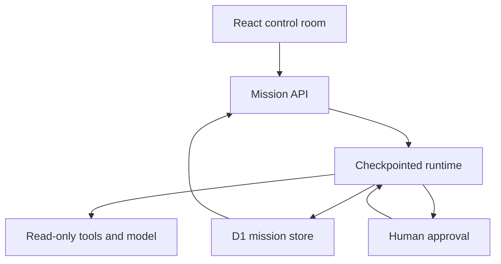

# Agent Observatory

**Watch an AI mission become inspectable work.** An animated control room for document and repository audits, with durable checkpoints, tool traces, evidence-linked findings and a human approval gate.

The characters are the actual procedural avatars from [hemvall/avatar-lab](https://github.com/hemvall/avatar-lab), synchronized with its upstream before integration. Their expressions and animations respond to the current role. The 14-character library is available in the inspector.

## Try it

1. Choose an example audit, a public GitHub repository, or your own document.
2. Launch the mission. Inspect a character, a tool trace, or a collected source.
3. Pause and resume, or disable automatic progression and advance one step at a time.
4. Read the finding cards, filter by severity or search, and open their cited sources. Approve the final report.
5. Download the report, traces or full mission. Compare two saved executions.

The mission briefing explains the current step and the next action. Interrupted connections show a stale-state notice and stop automatic progression until polling recovers. Reuse a paused or finished mission to prepare the same input for another run, without changing its saved history.

The interface is in French. The **Comment ça marche** view explains the runtime and its limits.

## Two honest execution modes

| Mode               | What happens                                                                                                                                                                                   | Credentials                  |
| ------------------ | ---------------------------------------------------------------------------------------------------------------------------------------------------------------------------------------------- | ---------------------------- |
| Deterministic demo | Real orchestration, source collection, rule-based findings, evidence checks, approval and persistence. Example scenarios use fixture documents. Repository/document scenarios read real input. | None                         |
| Connected AI       | The analysis stage calls OpenAI for structured, source-linked findings. The same execution and verification pipeline applies.                                                                  | Server-side `OPENAI_API_KEY` |

The demo reports zero tokens. The connected mode reports provider usage. No fabricated costs, model thoughts or semantic quality scores are shown. Traces contain actual tool input/output and short operational summaries.

## Run locally

Requires Node 24 and pnpm 11.25.0.

```sh
corepack enable
pnpm install --frozen-lockfile
pnpm db:local
pnpm dev
```

For connected AI, copy `.env.example` to `.dev.vars` and set `OPENAI_API_KEY`. This is a local Worker secret file and is ignored by Git. `OPENAI_MODEL` defaults to `gpt-4.1-mini`; use a model that supports strict JSON-schema output and the Chat Completions endpoint. Without a key, live-mode creation is refused and the full demo remains available.

```sh
pnpm typecheck
pnpm test
pnpm source:pack
pnpm build
```

`pnpm check` runs those checks and builds the application. In ChatGPT Work, the managed preview/build scripts are selected automatically. On other machines, the portable Vinext path is used.

## How it works



The seven stages are plan, collect, analyze, verify, approve, write and evaluate. Roles share one runtime: the four characters are not four independently autonomous models.

Each `advance` request performs one stage. The UI drives automatic progression while open. Each successful stage commits a trace and a new cursor. Pausing or cancelling changes the revision; an already in-flight result cannot overwrite that newer decision. A temporary lease protects simultaneous execution. A crashed lease expires after three minutes.

D1 stores the mission JSON, revision and lease. Schema changes live in Drizzle migrations. There is no browser-only mission history; browser storage is used solely for avatar preferences. The UI shows the latest 50 missions. All application data belongs to the private instance; this prototype does not implement multi-tenant account isolation.

GitHub collection is public and read-only. It inspects up to ten documentation/configuration files, a maximum of 40,000 characters, and pins file contents to blob SHAs from a single commit. It never runs repository code or tests. The collector rejects arbitrary hosts and oversized/truncated inventories.

## API

| Endpoint             | Operation                                         |
| -------------------- | ------------------------------------------------- |
| `GET /api/config`    | Provider availability, never the secret           |
| `GET /api/runs`      | Latest 50 mission summaries                       |
| `POST /api/runs`     | Validate and persist a new mission                |
| `GET /api/runs/:id`  | Read a checkpoint, traces and sources             |
| `POST /api/runs/:id` | `advance`, `pause`, `resume`, `approve`, `cancel` |
| `GET /api/source`    | Download corresponding application source         |

Example creation payload:

```json
{
  "scenario": "repository",
  "mode": "demo",
  "objective": "Analyser les fondations et les limites documentées de ce dépôt.",
  "repository": "hemvall/avatar-lab",
  "document": ""
}
```

Mutations validate their payloads and reject cross-origin browser requests. The hosted deployment remains private. A public deployment would require app-level authentication, per-user ownership, quotas and further abuse controls before enabling a paid model key.

## What is tested

The runtime tests cover the full approval flow, serialized pause/resume, invalid transitions, missing/unknown references, provider failure, explicit demo/live separation, bounded input and repository URL validation. The fork synchronization separately passed Avatar Lab's 211 tests, type checking, formatting and builds.

The application also exposes a feature-detected, read-only WebMCP tool, `inspect_selected_mission`. Its browser registration could not be tested in this environment; ordinary controls do not depend on WebMCP.

## Current limits

- Automatic progression needs an open page; there is no autonomous background queue.
- External model calls are not exactly-once. A crash after an external call and before its checkpoint may cause a repeated call on resume.
- The reference check validates IDs, not semantic correctness. Human review and domain evaluations remain necessary.
- The live provider adapter is implemented and covered by mocked failure/output tests. No paid live call was made during construction.
- Large repositories and binary documents are outside this first version's collection scope.
- Execution timing measures tool time, not end-to-end wall time or time waiting for human approval.

## License and attribution

AGPL-3.0-only, matching the integrated Avatar Lab sources. See [LICENSE](LICENSE) and [NOTICE.md](NOTICE.md). Corresponding source is offered in the UI and packed during the build workflow. The procedural renderer is vendored for reproducible installation; the shading integration is documented in the notice.
