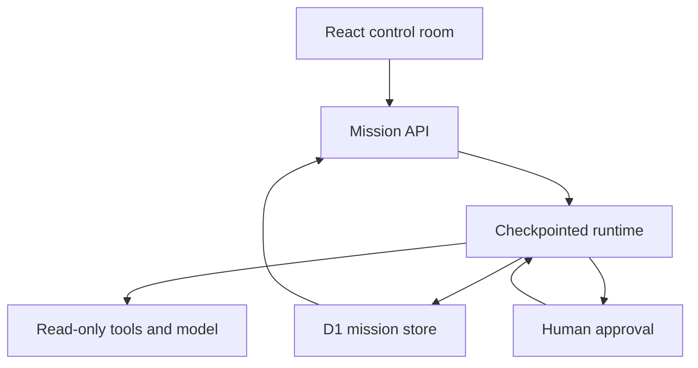

# Agent Observatory · AI Work Lab

**Construire un assistant documentaire, observer son exécution et comparer ses versions sur des tests reproductibles.**

## Premier parcours

1. **Documents** : choisir l’exemple fictif ou ajouter ses textes. Une configuration par défaut est prête. Le bouton principal enregistre les modifications et ouvre la question suivante.
2. **Poser une question** : saisir une question et lancer le test. Les agents se chargent automatiquement des étapes ; inspecter la réponse et ses sources.
3. **Vérifier les réponses** : enregistrer des questions avec leurs critères attendus, puis lancer les tests. Après les résultats, ajuster les réglages, comparer les versions ou télécharger l’assistant.

Les réglages du prompt, du modèle, de la recherche et des personnages sont repliés dans **Réglages de l’assistant**. Les simulations d’accès et de panne restent facultatives dans la question. La comparaison apparaît comme un outil secondaire lorsque deux versions existent.
L’exemple permet une comparaison concrète sans clé : V1 récupère un seul passage et réussit 2 tests sur 3. Une V2 avec trois passages réussit les trois tests, dont une question qui nécessite deux documents.

## Exécution et limites du laboratoire

**Local** extrait les passages pertinents sans appeler un modèle ; le prompt et le modèle ne sont pas exécutés. **IA connectée** appelle Groq ou OpenAI avec une clé serveur. Une clé manquante ne provoque aucune bascule silencieuse. La recherche est lexicale, sans embeddings. Quatre rôles fixes rendent visibles la préparation, la recherche, la réponse et les contrôles ; ce premier parcours ne propose pas de graphe d’agents arbitraire.

Les personnages de [hemvall/avatar-lab](https://github.com/hemvall/avatar-lab) sont animés pendant leur étape réelle, avec pause et préférence de réduction du mouvement. Les 14 apparences sont disponibles. Le journal montre les entrées/sorties opérationnelles, sans pensées cachées ni coûts inventés.

Les contrôles vérifient les citations exactes, les sources attendues, des expressions attendues/interdites et l’abstention. Ils ne constituent pas un jugement sémantique général sur la qualité. Les injections, contextes vides et pannes d’outil sont des scénarios de test signalés. Les rôles public/interne simulent des droits documentaires ; ils ne remplacent pas une authentification applicative.

Les projets, versions et expériences sont persistés en D1 avec révisions et verrous. Chaque expérience conserve une copie des documents, tests et configurations utilisés. L’onglet ouvert fait avancer les étapes ; il n’y a pas de file de travail autonome lorsque tous les onglets sont fermés. Les limites sont 12 documents, 60 000 caractères au total et 12 tests par comparaison.

L’export contient les documents du projet, y compris internes, mais aucune clé. Utilisation :

```sh
node --env-file=.dev.vars assistant.mjs "Quelle est la règle de résiliation ?" public
node --env-file=.dev.vars assistant.mjs --eval
```

Une évaluation exportée termine avec un code non nul si un critère échoue. L’analyse historique de documents et dépôts, ses checkpoints et son accord avant rapport restent accessibles via **Analyses** (`/analyses`).

## Analyses historiques

## Two honest execution modes

| Mode               | What happens                                                                                                                             | Credentials                                    |
| ------------------ | ---------------------------------------------------------------------------------------------------------------------------------------- | ---------------------------------------------- |
| Deterministic demo | Real orchestration and rule-based findings for fictional built-in examples only. Actual repository/document inputs require connected AI. | None                                           |
| Connected AI       | The analysis stage calls Groq or OpenAI for structured, source-linked findings. The same execution and verification pipeline applies.    | Server-side `GROQ_API_KEY` or `OPENAI_API_KEY` |

The demo reports zero tokens. The connected mode reports provider usage. No fabricated costs, model thoughts or semantic quality scores are shown. Traces contain actual tool input/output and short operational summaries.

## Run locally

Requires Node 24 and pnpm 11.25.0.

```sh
corepack enable
pnpm install --frozen-lockfile
pnpm db:local
pnpm dev
```

Pour utiliser ta clé Groq, copie `.env.example` vers `.dev.vars` et renseigne :

```dotenv
AI_PROVIDER=groq
GROQ_API_KEY=ta_cle_groq
GROQ_MODEL=openai/gpt-oss-20b
```

Après une mise à jour, arrête le serveur, lance `pnpm db:local` pour appliquer les migrations, puis redémarre `pnpm dev`. Le laboratoire sélectionne automatiquement le mode IA lorsque la clé serveur est configurée. La vue simple sélectionne automatiquement l’IA lorsque la clé serveur est configurée. La clé reste côté serveur, hors de Git et de l’archive source. Ne la préfixe jamais avec `NEXT_PUBLIC_`.

Groq utilise son propre endpoint `https://api.groq.com/openai/v1/chat/completions`. Le modèle par défaut est `openai/gpt-oss-20b`, exécuté chez Groq. Tu peux choisir un autre modèle Groq compatible avec les sorties JSON strictes, comme `openai/gpt-oss-120b`. Voir la [documentation Groq](https://console.groq.com/docs/structured-outputs).

OpenAI reste disponible avec `AI_PROVIDER=openai`, `OPENAI_API_KEY` et `OPENAI_MODEL` (défaut : `gpt-4.1-mini`). Sans `AI_PROVIDER`, une clé Groq non vide est prioritaire, puis OpenAI. Un fournisseur explicitement sélectionné ne bascule jamais vers l’autre si sa clé manque.

Pour la version hébergée, configure les mêmes variables côté serveur dans les paramètres du site ; `.dev.vars` concerne uniquement le développement local. Sans clé, le mode démo reste disponible. La présence d’une clé indique que l’IA est configurée ; sa validité est vérifiée lors du premier appel. Groq reçoit des lots d’au plus 6 000 caractères, avec 3 000 tokens de sortie réservés. Un 413 réduit automatiquement la taille du lot sans supprimer le contenu restant. Chaque lot réussi sauvegarde ses constats, ses preuves et ses tokens ; la reprise repart de la position enregistrée. Entre lots, les limites Groq sont respectées via les en-têtes de réinitialisation ou une attente prudente de 65 secondes. Un 429 programme une reprise selon `Retry-After`, avec trois reprises automatiques au maximum. L’interface affiche l’attente. La synthèse décrit le premier lot, les constats couvrent tous les lots.

```sh
pnpm typecheck
pnpm test
pnpm source:pack
pnpm build
```

En local, le serveur écoute sur `http://127.0.0.1:5173` et le rechargement automatique utilise un WebSocket dédié sur le port 24678, pour éviter le proxy du Worker. Si ce port est bloqué par le pare-feu, le rechargement automatique peut échouer ; les appels IA passent par HTTP et restent indépendants.

`pnpm check` runs those checks and builds the application. In ChatGPT Work, the managed preview/build scripts are selected automatically. On other machines, the portable Vinext path is used.

## How it works



The seven stages are plan, collect, analyze, verify, approve, write and evaluate. Roles share one runtime: the four characters are not four independently autonomous models.

Each `advance` request performs one stage. The UI drives automatic progression while open. Each successful stage commits a trace and a new cursor. Pausing or cancelling changes the revision; an already in-flight result cannot overwrite that newer decision. A temporary lease protects simultaneous execution. A crashed lease expires after three minutes.

D1 stores the mission JSON, revision and lease. Schema changes live in Drizzle migrations. There is no browser-only mission history; browser storage is used solely for avatar preferences. The UI shows the latest 50 missions. All application data belongs to the private instance; this prototype does not implement multi-tenant account isolation.

GitHub collection is public and read-only. It selects up to 16 code/documentation/configuration files, prioritizing README, manifests and backend/auth/API files, within a shared maximum of 40,000 characters, and pins file contents to blob SHAs from a single commit. It never runs repository code or tests. The collector rejects arbitrary hosts and oversized/truncated inventories.

## API

| Endpoint             | Operation                                         |
| -------------------- | ------------------------------------------------- |
| `GET /api/config`    | Provider availability, never the secret           |
| `GET /api/runs`      | Latest 50 mission summaries                       |
| `POST /api/runs`     | Validate and persist a new mission                |
| `GET /api/runs/:id`  | Read a checkpoint, traces and sources             |
| `POST /api/runs/:id` | `advance`, `pause`, `resume`, `approve`, `cancel` |
| `GET /api/source`    | Download corresponding application source         |

Example creation payload:

```json
{
  "scenario": "repository",
  "mode": "live",
  "objective": "Comprendre ce projet et identifier les améliorations prioritaires dans son code.",
  "repository": "hemvall/avatar-lab",
  "document": ""
}
```

Mutations validate their payloads and reject cross-origin browser requests. The hosted deployment remains private. A public deployment would require app-level authentication, per-user ownership, quotas and further abuse controls before enabling a paid model key.

## What is tested

The runtime tests cover the full approval flow, serialized pause/resume, invalid transitions, missing/unknown references, provider failure, explicit demo/live separation, bounded input and repository URL validation. The fork synchronization separately passed Avatar Lab's 211 tests, type checking, formatting and builds.

The application also exposes a feature-detected, read-only WebMCP tool, `inspect_selected_mission`. Its browser registration could not be tested in this environment; ordinary controls do not depend on WebMCP.

## Current limits

- Automatic progression needs an open page; there is no autonomous background queue.
- External model calls are not exactly-once. A crash after an external call and before its checkpoint may cause a repeated call on resume.
- The reference check validates IDs; connected analysis also requires exact quoted evidence and computes line numbers from the source text. These checks do not validate semantic correctness. Human review and domain evaluations remain necessary.
- The live provider adapter is implemented and covered by mocked failure/output tests. No paid live call was made during construction.
- Large repositories and binary documents are outside this first version's collection scope.
- Execution timing measures tool time, not end-to-end wall time or time waiting for human approval.

## License and attribution

AGPL-3.0-only, matching the integrated Avatar Lab sources. See [LICENSE](LICENSE) and [NOTICE.md](NOTICE.md). Corresponding source is offered in the UI and packed during the build workflow. The procedural renderer is vendored for reproducible installation; the shading integration is documented in the notice.
